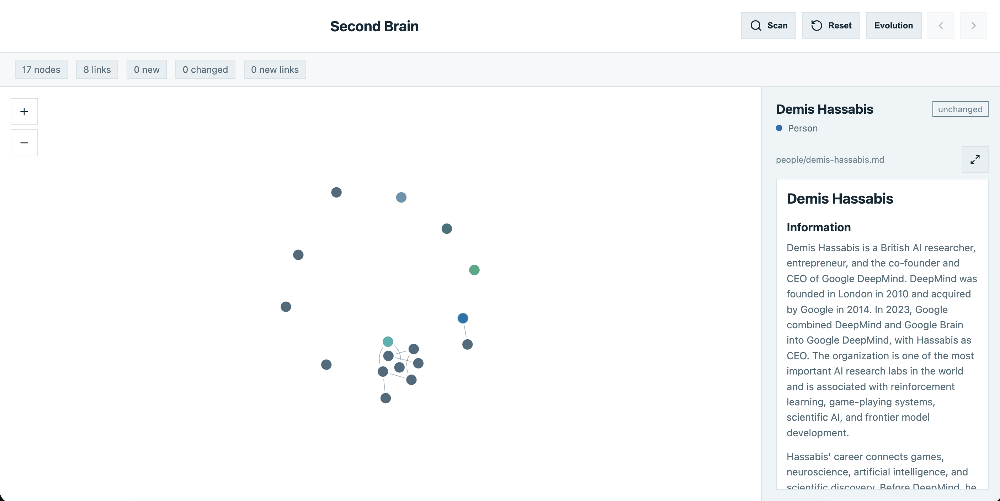

# Second Brain Agents

`LangChain` `Deep Agents SDK` `Cloudflare Tunnels`

Second Brain Agents turns incoming Markdown files into a browsable personal knowledge graph. The Organizer reads files from `input/`, uses an LLM-backed critique loop to compile durable notes into `brain/`, and the frontend visualizes the resulting network with semantic connections and evolution history.



## Ideal Flow

1. Capture Markdown from notes, articles, messages, or research.
2. Drop the files into `input/`.
3. Click **Scan** in the UI.
4. The Organizer agent reads the existing brain plus the new inputs.
5. The LLM critic loop improves notes and semantic links.
6. Generated Markdown lands in `brain/`.
7. The graph updates, highlights new nodes, and shows evolution.

## What It Does

| | Capability |
| --- | --- |
| `>>` | **Scan** new Markdown files from `input/`. |
| `<>` | **Organize** notes with an LLM-backed critique loop. |
| `##` | **Generate** clean Markdown into `brain/`. |
| `~~` | **Connect** notes through shared TF-IDF terms. |
| `??` | **Explain** each graph edge with the words that caused it. |
| `++` | **Replay** graph evolution as new notes appear. |
| `LS` | **Trace** model-backed Organizer runs in LangSmith. |

## Project Layout

```text
agentsday-hackathon/
|-- agents/
|   |-- organizer/              # Organizer agent, compiler, critic loop, graph builder
|   |-- researcher/             # Research agent support code
|   `-- ingestion/              # Telegram/cloud ingestion helpers
|-- frontend/                   # React + Vite graph UI
|   |-- src/
|   `-- vite.config.js          # Local API routes for scan/reset + brain static files
|-- input/                      # Drop Markdown files here before scanning
|-- brain/                      # Generated notes, graph.json, graph history
|-- runs/                       # Local traces, reports, subagent logs
|-- image/                      # README screenshots and visual assets
|-- context-non-slop/           # Durable context for future sessions
|-- pyproject.toml              # Python package and agent dependencies
`-- README.md
```

## Setup

Use Python 3.11+.

```bash
python3.12 -m pip install -e .
npm --prefix frontend install
```

Create `.env` from `.env.example`, then set Gemini and LangSmith keys.

## Run

```bash
npm --prefix frontend run dev -- --port 5173 --force
```

Open `http://127.0.0.1:5173`.

For a public demo URL, expose the local frontend with Cloudflare Tunnels:

```bash
cloudflared tunnel --url http://127.0.0.1:5173
```
