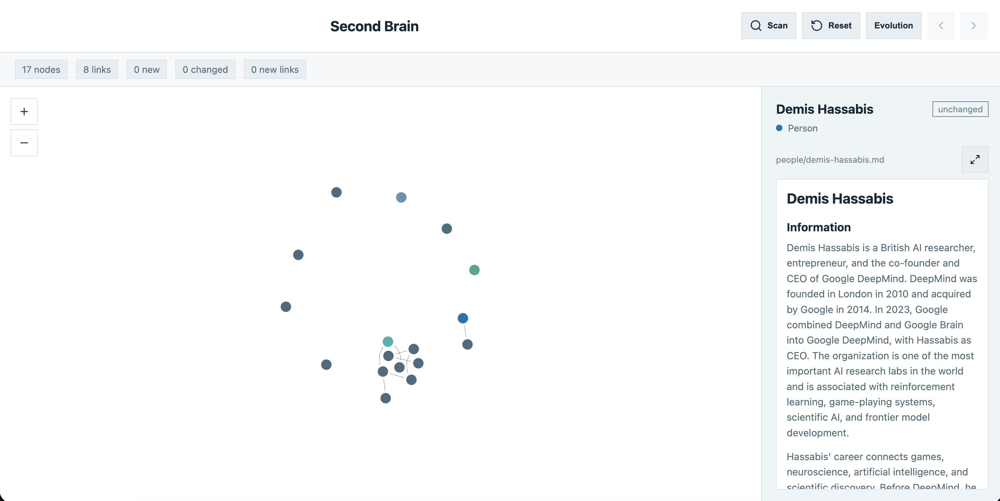

# Second Brain Agents

<p>
  
  
  
  
  
</p>

This project captures content sent to a Telegram bot, enriches it with scrapers, web search, and extraction tools, then hands it to a deep agent with specialized subagents. Together they update the knowledge base with the new information while checking that each note meets the project's quality criteria, and the frontend visualizes the resulting network with semantic connections and evolution history.

> **This was one of five projects selected for presentation at the Agentsday Hackathon on May 1, 2026.**



## Project Layout

```text
agentsday-hackathon/
|-- agents/
|   |-- organizer/              # Organizer agent, compiler, critic loop, graph builder
|   |-- researcher/             # Research agent support code
|   `-- ingestion/              # Telegram/cloud ingestion helpers
|-- frontend/                   # React + Vite graph UI
|   |-- src/
|   `-- vite.config.js          # Local API routes for scan/reset + brain static files
|-- input/                      # Drop Markdown files here before scanning
|-- brain/                      # Generated notes, graph.json, graph history
|-- runs/                       # Local traces, reports, subagent logs
|-- image/                      # README screenshots and visual assets
|-- context-non-slop/           # Durable context for future sessions
|-- pyproject.toml              # Python package and agent dependencies
`-- README.md
```

## Setup

Use Python 3.11+.

```bash
python3.12 -m pip install -e .
npm --prefix frontend install
```

Create `.env` from `.env.example`, then set Gemini and LangSmith keys.

## Run

```bash
npm --prefix frontend run dev -- --port 5173 --force
```

Open `http://127.0.0.1:5173`.

For a public demo URL, expose the local frontend with Cloudflare Tunnels:

```bash
cloudflared tunnel --url http://127.0.0.1:5173
```
